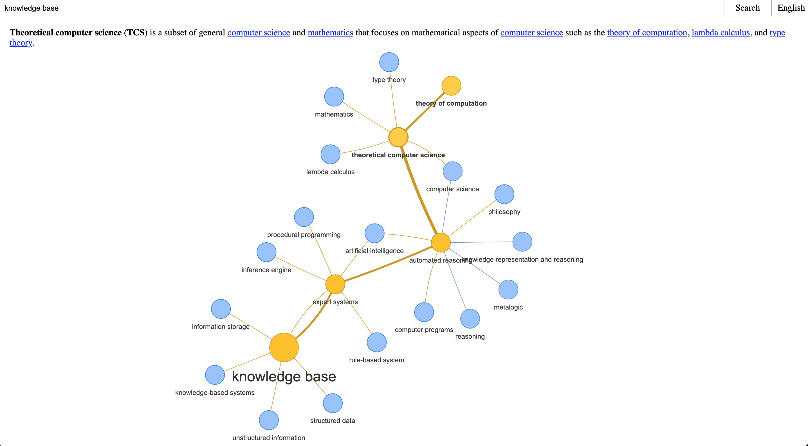
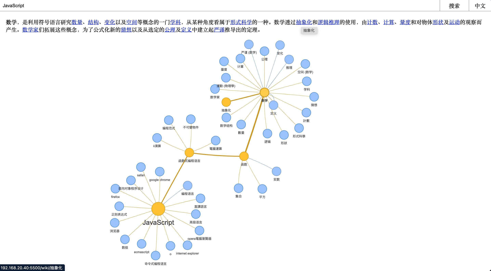

## 维基百科页面网状关系图

> 本项目为参考[wikipedia-map](https://github.com/controversial/wikipedia-map)所做

## 工作流程

1. 选择[英文 API](https://en.wikipedia.org/w/api.php)/[中文 API](https://zh.wikipedia.org/w/api.php)
2. 输入查询内容,点击搜索,程序将会检索维基百科上的第一段内容即描述性解析查询内容的语句,并从中截取相关维基百科链接.生成对应节点
3. 点击对应节点将继续搜索相关页面内容并生成更多节点
4. 可用鼠标移动到对应节点或者段落描述文字的链接上,相关节点路径会做高亮显示
